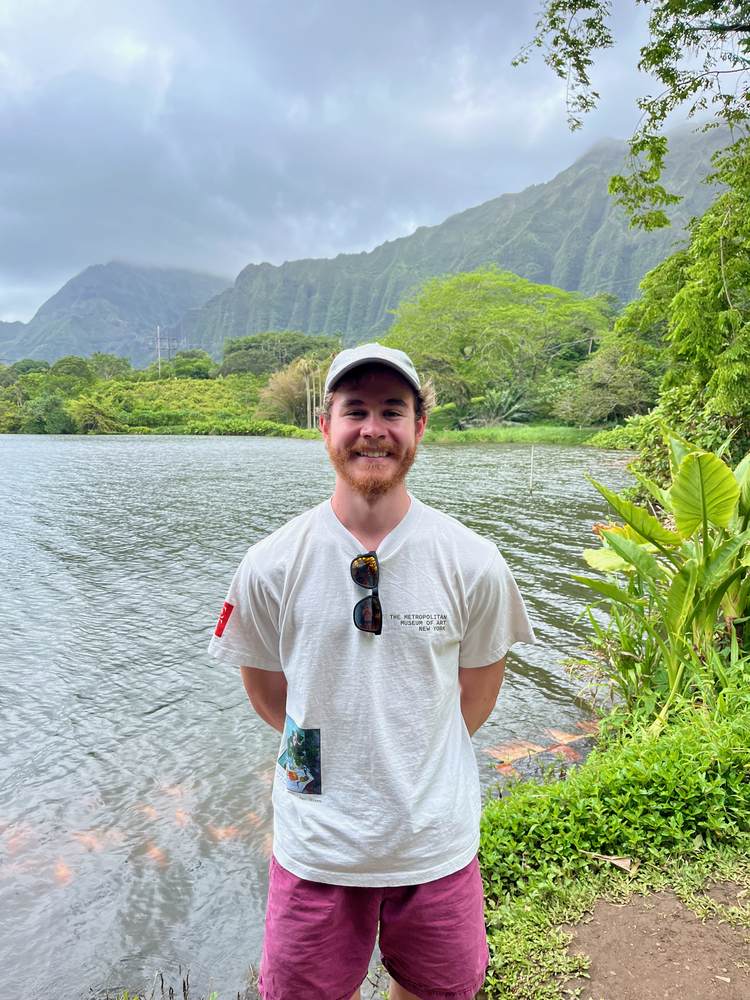

{: style="width: 190px; height: auto; border-radius: 15px; float: left; object-fit: cover; margin-right: 20px; margin-top: 2px"}

Before attending the University of Central Florida, I graduated from Bartram Trail High School while dual-enrolled at Saint Johns River State College. I earned my Associate of Arts degree alongside my High School diploma with plans to study electrical engineering; however, as many undergraduates can relate, my plans changed. I felt disingenuous with my current work and instead began to admire the complex science and history of human-drug relations and, subsequently, human biochemistry. With my former knowledge in math and digital systems, I started my new Chemistry Major with an eager desire to show my passion. After my major change with new biology and chemistry classes, I earned the UCF President's Honor Roll Certificate in the Fall of '23. In the Summer of '24, I changed my major once more to Biotechnology, furthering my focus in the academic world of undergraduate medicine studies.

As I continued to explore my goals I became further motivated to contunue my education, finding research a promsing avenue of creating real change. I have become motivated to contribute to the world of mental health research through personal life experiences and a drive to impact others' lives through breakthrough treatments.

Currently, as an undergraduate, I am learning the academic theories in class and the hands-on skills in technical labs to become a biotechnologist. I am also exploring the world of cognitive science, involving myself with philiospohy of the mind, ethics, and cognition. With a Bachelor's focus on biotechnology, I aim to later earn a Doctorate degree before continuing in my specialization in whatever may come my way.

My ultimate motivation is to contribute and be directly involved in  the scientific discussion and bridge the gap towards clinical treatment of mental health disorders---particularly relating the neurophysiology and behavioral changes of novel pharmacological and pyschotheraputic treatments for Major Depressive Disorder (MDD), Persistent Depressive Disorder (PDD), Obsessive-Compulsive Disorder (OCD), and Post-traumatic Stress Disorder (PTSD).

<!-- This is a placeholder, place a square professional headshot here when available.
{: style="width: 150px; height: 150px; border-radius: 50px; float: right; object-fit: cover; margin-left: 20px; margin-top: -20px"}
-->

Outside my academic schedule, I enjoy reading, writing poetry, exploring photography, and learning French & Spanish, Additionally, growing as a person with my interest in connecting with others on political, cultural, and environmental issues is near and dear to me. I am passionate especially as it relates to speaking out for the rights of those less fortunate. In the summer of '24 I was the President of the *Knights for Animals Rights* club, and I hope to contribute further for the support of animal rights as I grow. I am also a current member a UCF student led support group, namely *After The Sect*, which helps create a space for people who have experienced HCRGs.
