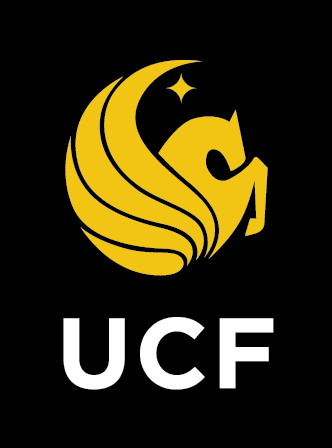

{: style="width: 90px; height: auto; float: right"}
Before attending the University of Central Florida, I graduated from Bartram Trail High School while dual-enrolled at Saint Johns River State College, wherein I earned my Associate of Arts degree with plans to become an Electrical Engineer. As is seen, my plans changed soon after my Freshman year at UCF. With my former knowledge in the depths of math and digital systems, I went into my new Chemistry major with eagerness and desire to show my passion. After my major change with new Biology and Chemistry classes, I earned the UCF President's Honor Roll Certificate in the Fall of '23.

Currently, as an undergraduate, I am learning the skills in my technical labs and the academic theory in class to become a certified Chemist. My degree is certified by the American Chemical Society and covers all five disciplines of chemistry: analytical, biological, inorganic, organic, and physical. With a focus on biochemistry, I hope to further degree my knowledge to a terminal Doctorate of Philosophy in Pharmacology. Currently, my proficiency lies in the intermediate understanding of neurobiology and a daily growing knowledge of organic chemistry as it relates.

My research areas of interest are in neuropharmacology, keenly behavioral neuropharmacology.

Ultimately, I aspire to contribute my voice to scientific discussions and advance our understanding of therapeutical and medical treatments for global mental health disorders, particularly focusing on Major Depressive Disorder (MDD), Persistent Depressive Disorder (PDD), and Obsessive-Compulsive Disorder (OCD). My goal is to influence the development of innovative, novel treatments and improve the quality of life for individuals affected by these conditions.

Outside the academic world, I enjoy a good book with a view, exploring my creative side with poetry or photography, and learning French. *C’est chouette !*
