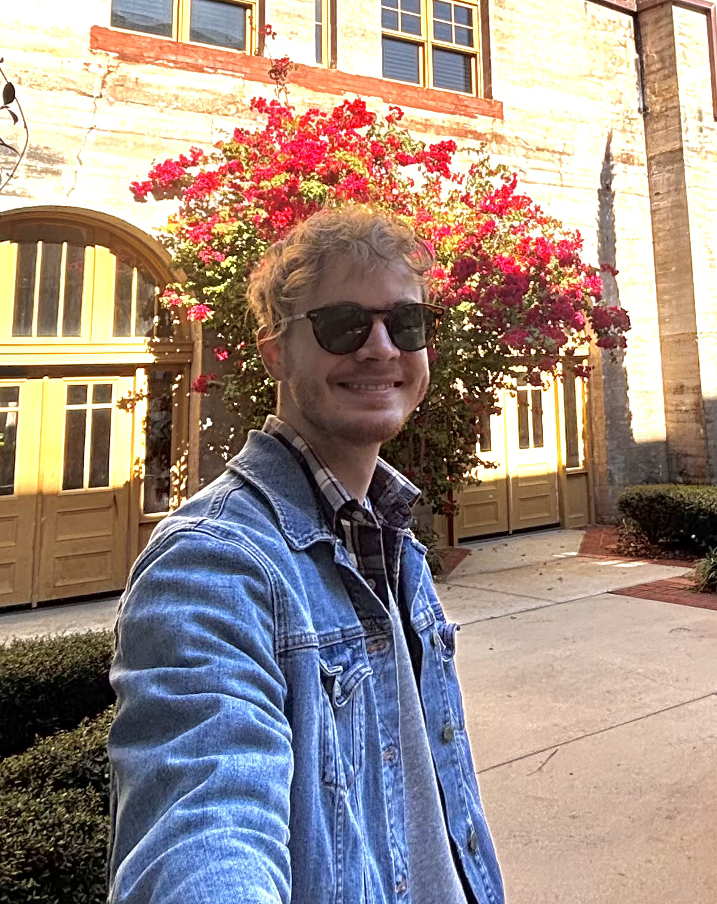

---
# To modify the layout, see https://jekyllrb.com/docs/themes/#overriding-theme-defaults

layout: home
permalink: 
---

<h1 style="font-size: 24px;">Hello and Welcome!</h1>
{: style="width: 205px; height: 250px; border-radius: 90%; float: right"}
 
I'm **Thomas**, a Psychology undergraduate with a concentration in Neuroscience at the University of Central Florida. Following graduation, my aim is to continue my studies in a graduate program aligning with my research interests: translational medicine in the treatment of mental health disorders.

I'm passionate about the behavioral neuropharmacology of people - the study of how medicine affects the human mind and observed behaviors. Aside from behavioral neuropharmacology, *non-pharmacological* in tandem with *pharmacological* approaches to psychotherapy for treating mental health disorders are the current focus of my undergraduate research; alongside the sociological origins of stigmas against novel mental health treatments like ketamine infusions and psilocybin therapy. I hope to develop these ideas further as part of my graduate studies.

This website serves as a showcase of my passions as it relates to my [research](research) and [broader impact](broaderimpact). My [CV](cv) is also available for viewing. Feel free to contact me using the info below.

Thanks for visiting!
