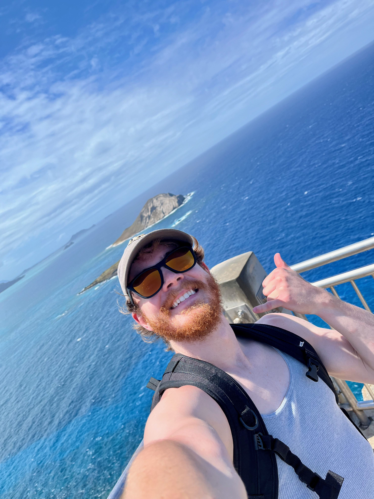

---
# To modify the layout, see https://jekyllrb.com/docs/themes/#overriding-theme-defaults

layout: home
permalink: 
---

<h1 style="font-size: 24px;">Hello and Welcome!</h1>
{: style="width: 200px; height: auto; border-radius: 50%; float: right"}
 
My name is **Thomas Edwin Bischoff**, I'm an Undergraduate Biochemistry Student at the University of Central Florida. My academic intention is to earn a Ph.D. in the field of pharmacology.

My passion lies in behavioral neuropharmacology, that is, the study of medicine and drugs on biological organisms that affect the mind, and because of that, changes in observed behavior. 

This website serves as a showcase of that passion as it relates to [my story](aboutme), my [research](research), and [volunteer experience](volunteerexp). My [CV](CV) is also available for download as a concise expression of that. And my contact information will always be listed at the bottom of each page for those interested.

Thanks for visiting!
