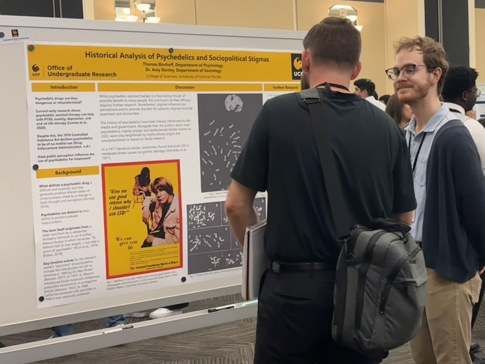
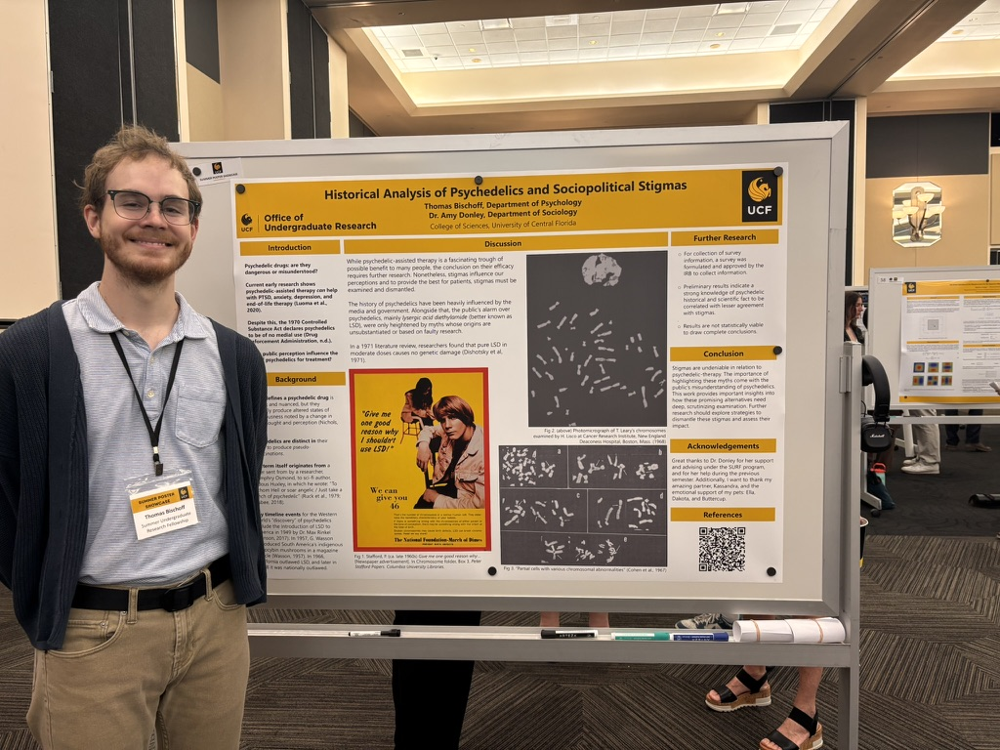

I am currently involved in a wide range of interdisciplinary fields. Here, I lay out the relevant accomplishments I have made as an undergraduate researcher. My current research involves investigating college students' perceptions and stigmas on psychedelics being used in therapy. As my research further develops, I hope to add a summary of my findings on this page, including my eventual publication.

#### Click on any box to see more:

<!--
<html>
<head>
  <meta>
  <meta name="viewport" content="width=device-width, initial-scale=1.0">
  <title>2x2</title>
  
</head>
<body>
 
  

    

      <h2>Relevant Coursework</h2>
      <ul>
        <li>Neurobiology</li>
        <li>Psychobiological Aspects of Drug Use</li>
        <li>Organic Chemistry I and II, with Lab Techniques</li>
        <li>Genetics with Lab Techniques</li>
        <li>Calculus with Analytical Geometry I & II</li>
      </ul>
    

    

      <h2>Certifications</h2>
      <ul>
        <li>Human Subjects Research - CITI Program:
          <ul>
            <li>Group 1. Biomedical Research Investigators and Key Personnel (<a href="https://www.citiprogram.org/verify/?we8b83e71-36a2-4872-bd41-80de2c647f2a-58559539">Show Credential</a>).</li>
          </ul>
        </li>
      </ul>
    

    

      <h2>Current Interests</h2>
      <ul>
        <li>Sociological points of view relating to stimga of translational medicine.</li>
      </ul>
    

    

      <h2>Future Goals</h2>
      <ul>
        <li>Publish research as an undergraduate.</li>
      </ul>
    

  

</body>
 
</html>

-->

<html>
<head>
  <meta>
  <meta name="viewport" content="width=device-width, initial-scale=1.0">
  
</head>
<body>
 
  

    <!-- First box -->
    

      

        

          <h2>Relevant Coursework</h2>
          <ul>
            <li>Neurobiology</li>
            <li>Psychobiological Aspects of Drug Use</li>
            <li>Organic Chemistry I and II with Lab Techniques</li>
            <li>Neuropsychology</li>
            <li>Physiological Psychology</li>
          </ul>
        

        

          <h2>Rewards & Honors</h2>
         <ul>
          <li>President’s Honor Roll @ UCF - Earned a 4.0 semester GPA.</li>
           <li>Cum Laude Institutional Honor @ Saint John’s River State College - Earned above a 3.0 honorary GPA.</li>
           </ul>
        

      

    

    <!-- Second box -->
    

      

        

      <h2>Certifications</h2>
      <ul>
        <li>Human Subjects Research - CITI Program:
          <ul>
            <li>Group 1 & 2. Biomedical & Social/Behavioral Research Investigators and Key Personnel (<a href="https://www.citiprogram.org/verify/?we8b83e71-36a2-4872-bd41-80de2c647f2a-58559539">Show Credential 1</a>, <a href="https://www.citiprogram.org/verify/?w871ea281-2a9d-44ea-b01e-39e8d037302e-61191437">Credential 2</a>).</li>
          </ul>
        </li>
      </ul>
        

        

          <h2>Languages</h2>
          <ul>
          <li>English: Native</li>
          <li>Spanish: Elementary (CEFR A1)</li>
          </ul>
        

      

    

  

 
    <!-- third box -->
    
<!-- ends line 217
    

      

        

          <h2>Literature Review Expereince - Historical Anaylsis</h2>
          
Click me to flip!

        

        

          <h2>Back Side</h2>
          
Here’s more hidden information.

        

      

    

-->

    <!-- fourth box -->
    

      

        

          <h2>Sociopolitical Stigmatization of Psychedelics</h2>
          
At UCF's Summer Undergraduate Poster Showcase I was able to present my research to a wide aray of people.

{: style="border-radius: 1%; float: center"}

        

        

          <h2>More Information</h2>
          
My experience in the associated Summer Undergraduate Research Fellowship allowed me to express the skills required to take on this achievement. I would like to give thanks to my faculty advisor Dr. Amy Donley of the Sociology Department.

{: style="height: 500px; border-radius: 1%"}

        

      

    

  
</body>
</html>

### Contact Information
If you have any research opportunities or would like collaborate please reach out to me via my [academic email](mailto:th789984@ucf.edu).
