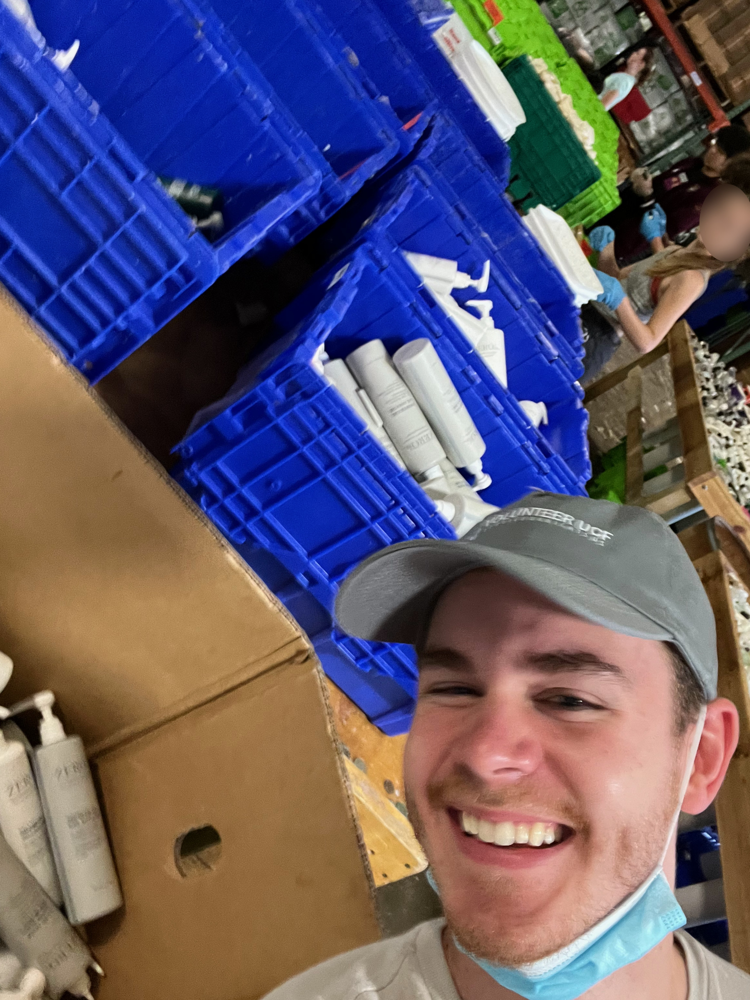

<!-- see notes for overhaul ideas -->

<!-- ## ############################################## ## -->
<!-- ## Images captured in markdown to be used in html ## -->
<!-- ## ############################################## ## -->

 
{: style="width: 155px; height: auto; border-radius: 15px; float: right; object-fit: cover; margin-left: 10px; margin-top: 7px"}


<!-- ## ############################################## ## -->
<!--                  ## Introduction ##                  -->
<!-- ## ############################################## ## -->

Volunteering is the basis for social change. Social change, to me, is the persistent striving for the betterment of our communities at large. This betterment ultimately involves providing help, awareness, and goodness without expecting return. This social change starts with those who are in the position to provide the most help at the most opportune time.

Below is my timeline of Volunteering Experiences, I hope to grow this list as I grow likewise.

<html>
<head>
    
</head>

    
<!-- ## ############################################## ## -->
<!--              ## Volunteer Timeline ##             ## -->
<!-- ## ############################################## ## -->
    
<body>
    <!--
--> 
    
    
    
        <!-- 

        Use this template below to create a new entry:

        

        

        
Semester 2049

        

          <h3>Title</h3>
          {{ VARIABLE | markdownify }}
Paragraph text

        

        

        -->
    
    <!-- Volunteer UCF Fall 2023 -->
    
    

    
    

    
Fall 2023

    

      <h3>Volunteer UCF</h3>
      {{ ctwimage | markdownify }}
Involved myself in student-run orginization dedicated to allowing students to get envolved in community research around the Orlando area. I engaged in many projects over the Semester including <i>Clean The World Sorting</i>, where I helped sort soap and other hygine products for recycling; assisted <i>Knights Pantry</i> with moving backlogs of items in storage; creating Holiday Cards for Children; helped <i>United Against Poverty</i> with food donation sorting; and gave water out for a hosted 5 and 2 mile race sponsored by <i>Advent Health</i>.

    

    

    

    
    <!-- Summer Student Front Desk Intern BTHS Summer 2021 -->

    
  
    
  

    
Summer 2021

    

      <h3>Summer Student Front Desk Intern</h3>
      {{ VARIABLE | markdownify }}
In this position I oversaw and managed front desk duties including organizing mail, answering calls, and handled communication with parents and school personnel. I also learned professional etiquette and accountability.
 
    
  
    
  <!--
-->
    

    
    
    
  
        
        
</body>
</html>
